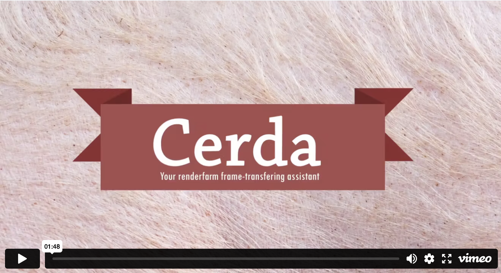

# Cerda

**Cerda** is a command-line utility designed to automate the transfer of
rendered files from the render farm to either a local disk or a connected
Dropbox account. It also includes an email notification feature, which alerts
the user once a specified number of frames have been completed.

### Project Links

- **Repository**: [github.com/eulersson/cerda](https://github.com/eulersson/cerda)
- **Demo**: [vimeo.com/docwhite/cerda](https://vimeo.com/eulersson/cerda)
- **Documentation** (Sphinx): [eulersson.github.io/cerda](https://eulersson.github.io/cerda)
- **PyPI**: [pypi.org/project/cerda](https://pypi.org/project/cerda)

**Note:** Cerda is intended for use within the NCCA labs environment.

Due to the lack of administrative privileges in the lab systems, installation
instructions include steps for setting up `pip` locally. The process has been
kept minimal and straightforward.

**Warning:** Cerda is in an early stage of development. Contributions and issue
reports are welcome via the [GitHub
repository](https://github.com/eulersson/cerda).

### Upcoming Features

- Integration with `Qube` to allow direct dispatching of render jobs without
manual setup.
- Improved email formatting with thumbnail previews of rendered frames.

## Prerequisites

If you are in the labs you will need to install `pip` locally.

Follow these steps carefully:

Open a terminal and change directory to home

    $ cd ~

Get the pip installer script with `wget` (downloads a file form the web)

    $ wget https://bootstrap.pypa.io/get-pip.py -P ~

Install pip locally (it will get installed to `~/.local`)

    $ python ~/get-pip.py --user

Append the binaries directory that contains all the pip executables to your
`$PATH` variable. Either do it manually or simply execute this line of code
that will write a new line on your `.bashrc` file:

    $ echo "PATH=\$PATH:~/.local/bin" >> ~/.bashrc

Close the shell and start a new one. Alternatively reload your profile:

    $ source ~/.bashrc

## Installation

Now you got pip up and running! The next move is to install the tool using it

    $ pip install cerda --user

## Usage

Check out the help command `cerda -h`:

    usage: cerda [-h] [-dbox] [-e EMAIL] [-c COUNT] [-r EVERY] [-t CUSTOMTYPES]
                 source target

    An NCCA render farm collector.

    positional arguments:
      source                Remote location path (relative to home) where the
                            frames get generated.
      target                Custom file extensions to mark for transfering. I.e.
                            -t tiff,exr,obj

    optional arguments:
      -h, --help            show this help message and exit
      -dbox, --dropbox      Will send the files to the root path of your dropbox
                            account.
      -e EMAIL, --email EMAIL
                            Email address to send notification to after -c frames
                            have been rendered.
      -c COUNT, --count COUNT
                            At this numer of frames, send an email to the address
                            specified with -m flag.
      -r EVERY, --every EVERY
                            How often to check for frames dropped (in seconds)
      -t CUSTOMTYPES, --customTypes CUSTOMTYPES
                            Custom file extensions to mark for transfering. I.e.
                            -t tiff,exr,obj

**Warning:** Please make sure the **paths** you pass in are relative to your home folder.

## Examples

### Example 1

My renderfarm is rendering out the frames at `/home/i7243466/project1/render` 
on the **tete** server. I want the frames to get transfered to my local drive at
location `/home/i7243466/rendered/frames`:

    $ cerda project1/render rendered/frames

Or you could also use the short flags:

    $ cerda project1/render rendered/frames

### Example 2

My renderfarm is rendering out the frames at `/home/i7243466/project1/render` 
on the **tete** server. I want the frames to get transfered to my Dropbox
account under `/some/folder`

    $ cerda project1/render some/folder --dropbox

Or

    $ cerda project1/render rendered/frames -dbox

### Example 3

My renderfarm is rendering out the frames at `/home/i7243466/project1/render` 
on the **tete** server. I want the frames to get transferred to my Dropbox
account under `/some/folder` **and** when it has finished rendering, which
means 20 frames get collected, send me an email notification:

    $ cerda project1/render some/folder --dropbox --email blanquer.ramon@gmail.com --count 20

Or

    $ cerda project1/render rendered/frames -dbox -e blanquer.ramon@gmail.com -c 20

When it is finished you will receive an email from **cerdancca@gmail.com**.
Hopefully it won't get blocked as I am using Google's own SMTP servers.

If you find any problem or bug please report it using the Issues page or drop me a line at blanquer.ramon@gmail.com

### Example 4

My renderfarm is rendering out Alembic **.abc** files at `/home/i7243466/project1/render` 
on the **tete** server. I want the files to get transfered to my local drive at
location `/home/i7243466/hello/alembics`:

    $ cerda project1/render hello/alembics --customTypes abc

Or you could also use the short flags:

    $ cerda project1/render hello/alembics --t abc

You can specify more than custom type to transfer like ``--customTypes png,jpg,abc,tiff``
No spaces, separated by commas.
